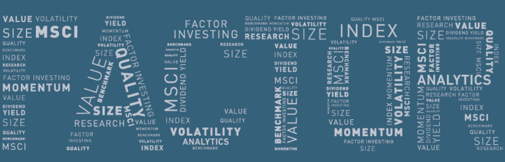
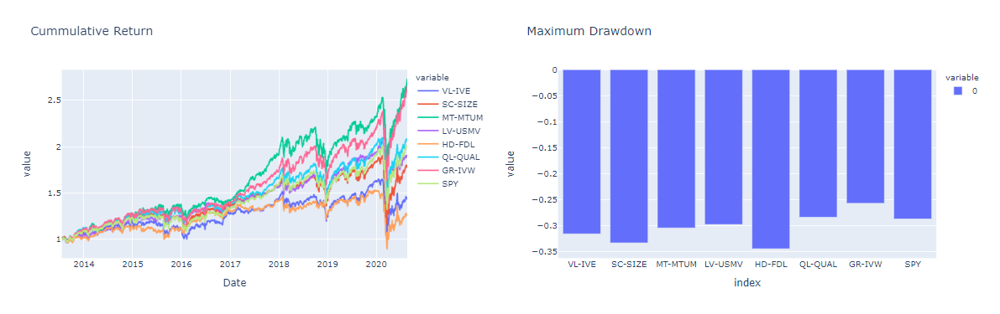
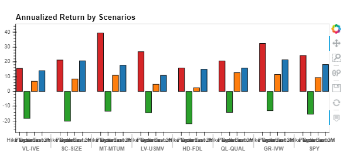
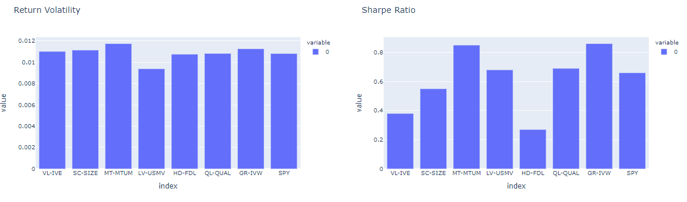
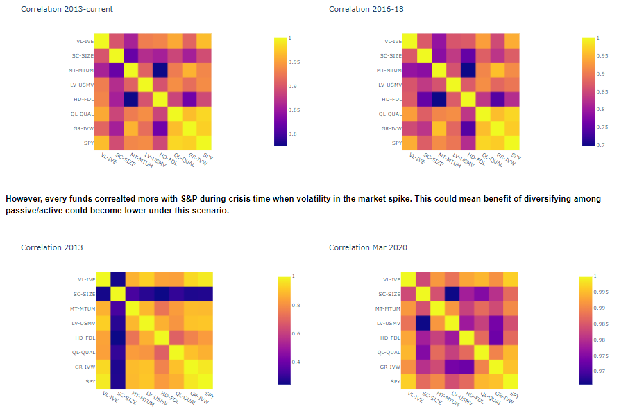
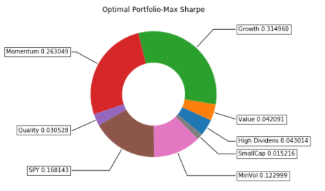
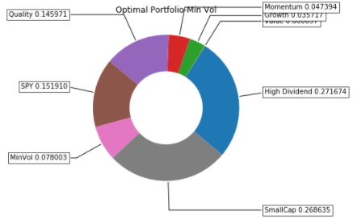
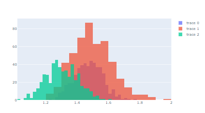

# Active vs Passive Funds

### Contributors: 
Phara Dorisca (https://github.com/pdorisca), Khulika Rojanakanoksak (https://github.com/Khulikaroj), Femi Aina (https://github.com/Femi-tech) ,Ogo Nwanyanwu (https://github.com/Ogo1024)

In this project, we try proposing an optimal equity portfolio which give the best risk-return tradeoff from allocating between passive fund and active fund. First, we look at risk/return characteristic of passive and active funds in the past to see which type of portfolio perform best. Then we construct portfolios based on conclusion we have from historical data analysis. We project return of the portfolio and evaluate risk/return characteristic. 
Active funds that we analyze in this project will be based on factor investing idea. These funds’ allocation will deviate from market index and based on key underlying factors that each type of fund designed to beat market return. According to MSCI, there are 7 groups of active funds.  
1.	Value: This fund will try to include stocks with cheap valuation into portfolio to capture investment opportunity from price traded below fundamental value. We pick IVE (iShares S&P 500 Value ETF) as represent fund for this group.
2.	Small Cap:  This fund will try to generate alpha by picking smaller firms (by market capitalization) relative to their larger counterparts. We pick SIZE (iShares Edge MSCI USA Size Factor ETF) as represent fund for this group.
3.	Momentum: This fund will try to generate alpha by selecting stocks with strong past performance. We pick MTUM (iShares Edge MSCI USA Momentum Factor ETF) as represent fund for this group.
4.	Low volatility: This type of fund will try to capture excess returns to stocks with lower than average volatility, beta, and/or idiosyncratic risk. We pick USMV (iShares Edge MSCI Min Vol USA ETF) as represent fund for this group.
5.	High Dividend: This type of fund will try to excess returns to stocks that have higher-than-average dividend yields. We pick FDL (First Trust Morningstar Dividend Leaders) as represent fund for this group.
6.	Quality: This fund will try to generate alpha by including stocks that are characterized by low debt, stable earnings growth, and other “quality” metrics. We pick QUAL (iShares Edge MSCI USA Quality Factor ETF) as represent fund for this group.
7.	Growth: Alpha from this kind of fund would come from adding high growth stocks into portfolio. We pick IVW (iShares S&P 500 Growth ETF) as represent fund for this group.

### Hypothesis of project: 
Will Active investment generate return more than Passive Investment?

### Data and Method:
In this analysis, we use daily price data of each fund from Yahoofinance as the source give flexibility in using without any access key and easier to update the data to the most recent date available. Moreover, all codes can be downloaded and run on local location without csv data needed.  ETFs funds that we pick in this analysis will be based on (1) earliest inception date of ETFs to get maximum data points and (2) large Asset Under Management (AUM). Our data cover  07/18/2013 to the most recent date. We use ffn library in analysing funds' risk and return characteristic to gain understanding in each active investment style. We also look into risk and return characteristics in different scenarios in the past to check if each fund perform differently under different context such as (1) Taper Tantrum which represent the period of high market volatility in 2013  as investors feared that Fed will withdraw large amount of support in bond market and could increase funding rate. (2) Hike cycle in 2016-18  which represent period of good economic growth that Fed feel confident to increase policy rate. (3) Recent market turmoil during COVID pandemic which cause VIX index to spike in Mar. 

### Historical Analysis:

We are looking at return and risk characteristic of S&P index, a passive fund, and active funds like Value funds (VL), Momentum funds (MT), Qyality fund (QL), Growth (GR), and High Dividend (HD). Price and return data are daily frequency covering 07/18/2013 to the most recent date. We found these findings,

(1) Return of every active fund is positively correlated to S&P.  

(2)Looking at fund's return volatility in the past 7 years, all active funds have similar vol as S&P except Low Vol fund which try to capture beta by low-volatile stick in nature. 

(3)In term of tradeoff between risk and return, Momentum(Sharpe ratio 1.26), Growth (1.28), Quality (1.04) and Low Vol (0.68) Funds offer better risk-adjusted return compared to S&P index(0.65). 

(4) In performance front, active funds could outperform S&P by 4% annually. Annualized return from investing in S&P in the past 7 years is 10.29% (annualized return since inception). The best performer among active funds is Momentum (MT-MTUM) which generate annualized return at 14.60%. Follow by Growth (GR-IVW, 14.37%), Quality (QL-QUAL, 10.91%). Even Value funds underperform S&P but annualized return are still positive. Majority of High Dividend funds generate loss.However, rank of performance change in recent shorter horizon. Outperformance of Momentum fund is pretty robust, except in the past 3 months that Momentum Fund (17.72%) underperform S&P (18.20%). Growth Fund (21.41%) and Small Cap Fund (20.72%) are the best performers in the past 3 months as propect of economic growth improved.Growth fund is also performed slightly better than market index during tough time. Maximum Drawdown of Momentum fund is -34.08%, slightly than -34.10% of S&P index. However, MDD is shallower for HD-HYG (-28.05%)

(5) During Taper Tantrum period in 2013, Momentum (25.66% since incep ann) and Quality (30.10%) funds outperformed S&P (21.78%). Value fund (15.79-15.95%) turned out underperformed market index and were more volatile. Similar conclusion seen in pandemic scenario. Momentum (25.66%) also outperformed S&P (21.78%) during hiking cycle together with Low Vol (8.29%) and Growth (9.86%). During market turmoil, Growth Fund has smallest MDD (-25.73%) and slightly lower than S&P (-28.74%).  

(6) Interestingly, every funds correalted more with S&P during crisis time when volatiliry in the market spike. This could mean benefit of diversify among passive/active could become lower durinf crisis time.

## Return Simulation and Portfolio Optimization:
We compare 3 portfolios and analyze the result based on what we can concluded from funds' characteristic in the past. We construct 3 portfolios from passive and active funds we analyzed in the prior part. These 3 portfolios are  (1) Equally-Weighted Portfolio, (2)Maximum-Sharpe Portfolio, and (3)Minimize-Volatility Portfolio. We simulate 1-year projected return and compare optimal weight of each portfolio and found out that, 

(1)Based on historical data in the past 7 years, max-sharpe optimal portfolio can offer more upsidde in 1-year projected return compared the the rest. With 95% confident level, return of Equally-Weighted Portfolio would be between 32% and 63% while Maximum-Sharpe Portfolio's projected return would be between 30% to 72%. However, projected return in 1-year horizon of Minimize-Volatility Portfolio could be between 15% to 48% with 95% confident level.

(2) More allocation into Growth and Momentum funds provide upside in the projected return. In Max-Sharpe Portfolio, optimal weight in Growth and Momentum ETFs are 31.50% and 26.31%,respectively. These are higher than 12.5% in Equally-Weighted Portfolio. In contrast, allocation of Growth and Momentum ETFs in Min-Vol Portfolio are smallest compared to allocation of other funds in the same portfolio. Min-Vol Portfolio would allocate more into High Dividend (27.17%) and Small Cap funds (26.86%).

---
## Conclusions:

### In historical analysis, Momentum fund, Growth Fund, and Quality Fund outperform S&P500 in the past 7 years. Growth Fund and Quality Fund have smaller MDD compared to S&P500.

### Outperformance of Momentum fund is pretty robust under different scenarios, except in the past 3 months that Momentum Fund underperform S&P. Growth Fund and Small Cap Fund are the best performers in the past 3 months as propect of economic growth ir improving.

### In term of tradeoff between risk and return, Momentum, Growth, Quality and Low Vol Funds offer better risk-return trade off compared to S&P index.All active funds have positive correlation to S&P500. However, every funds correalted more with S&P during crisis time when volatility in the market spike. This could mean benefit of diversifying among passive/active could become lower under this scenario.

### In portfolio optimization, allocating more in Growth, Momentum and Quality funds yield optimal portfolio with maxmimum Sharpe ratio. Meanwhile, allocating more in High Dividend fund give optimal portfolio with maxmimum Sharpe ratio.

### Compared to equal-weight portfoliom, Max-Sharpe portfolio can increase average return in 1Y-projected period while enhance upside gain. In contrast, Min-Vol would lower portfolio’s volatiliry with the cost of lower return.

---
## File Directory

Jupyter Notebook file: master notebook.ipynb

Interactive Dashboard: active-vs-passive-fund.html